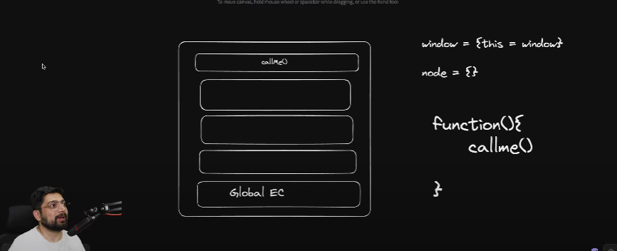

- humare javascript ke engine mein memory heap aur call stack hota hai. Above picture mein call stack show kiya hai.
- sbse neeche usmein global execution context hota hai. 
- ab jese jese naye function call hote hai unka execution context iss call stack mein add hota rehta hai.
- ab agar humare pass ek function() hai aur uske  andar ek aur fucntion hai callme() to pehle function ka execution context call stack mein jayega then callme() ka execution context function mein jayega.
- ab agar ismein this keyword use krenge to isko kese pta chlega ki kya context hai? aur kisko refer krna?
- ese cases mein this humare global execuion context ko refer krta hai. Window object in browser and empty object on node
- IN browser global execution context refers to window object, but node enviromment mein window hai nhi to vo empty object ko refer krta hai.